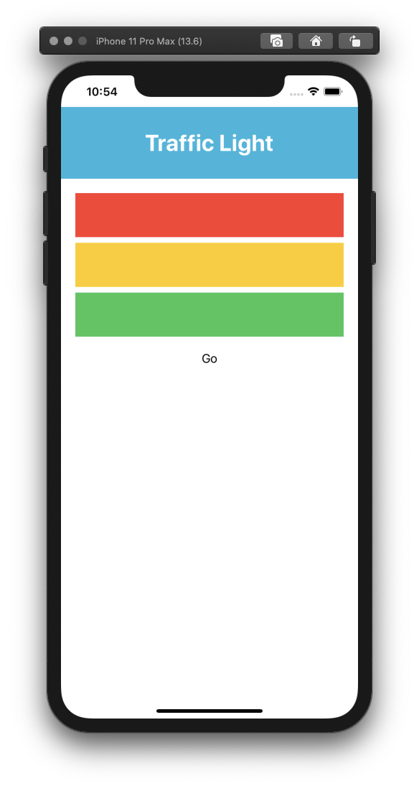

# ios-mvp

### 1. iOS Swift : MVP Architecture
Learn basic MVP Design Pattern using static data to check which color we've been select and show the description of the color. 
* You can check the full tutorial [here](https://medium.com/@saad.eloulladi/ios-swift-mvp-architecture-pattern-a2b0c2d310a3). 
&nbsp;
&nbsp;
